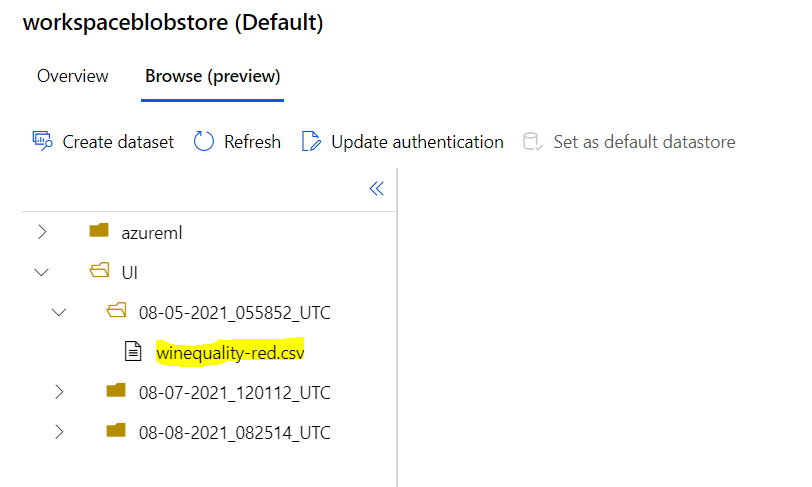
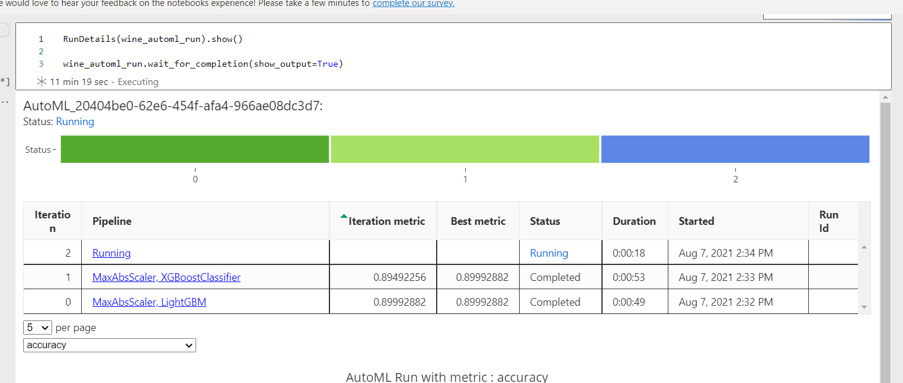
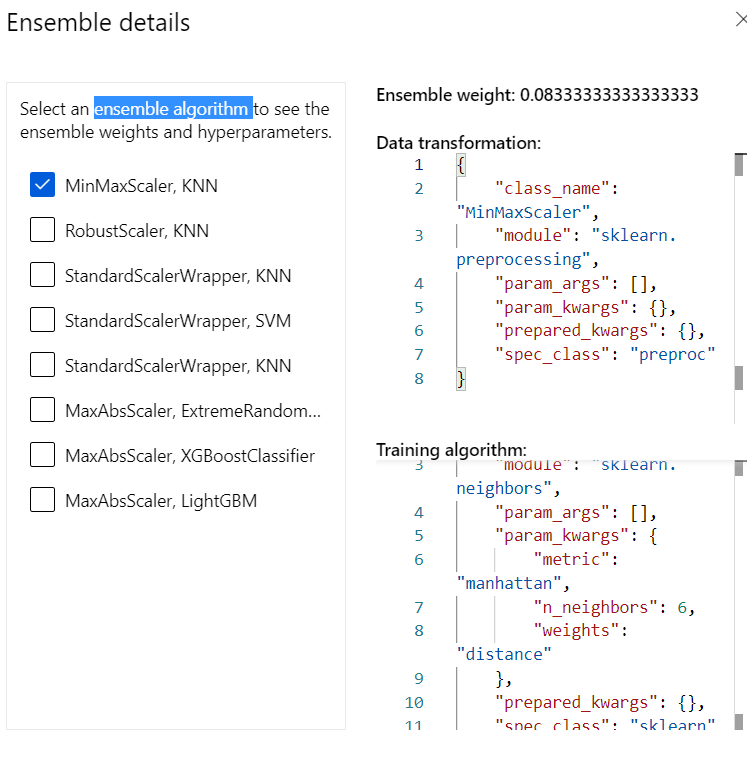
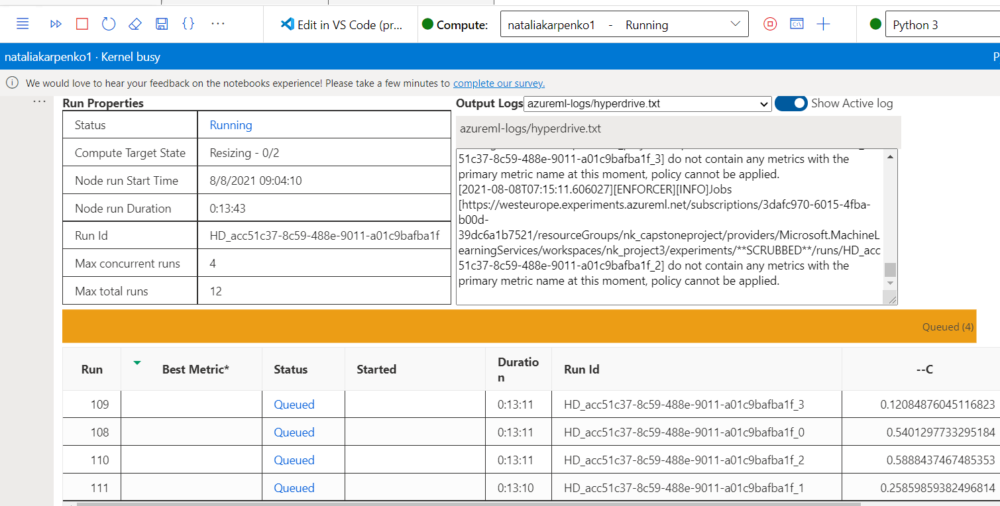
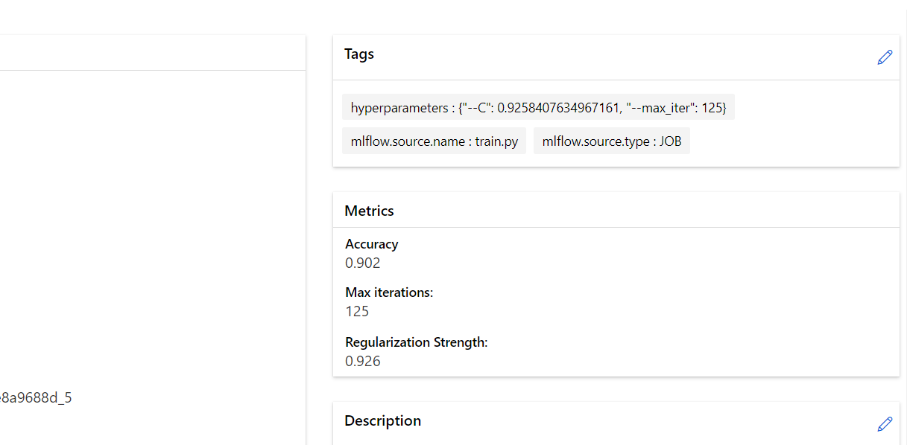
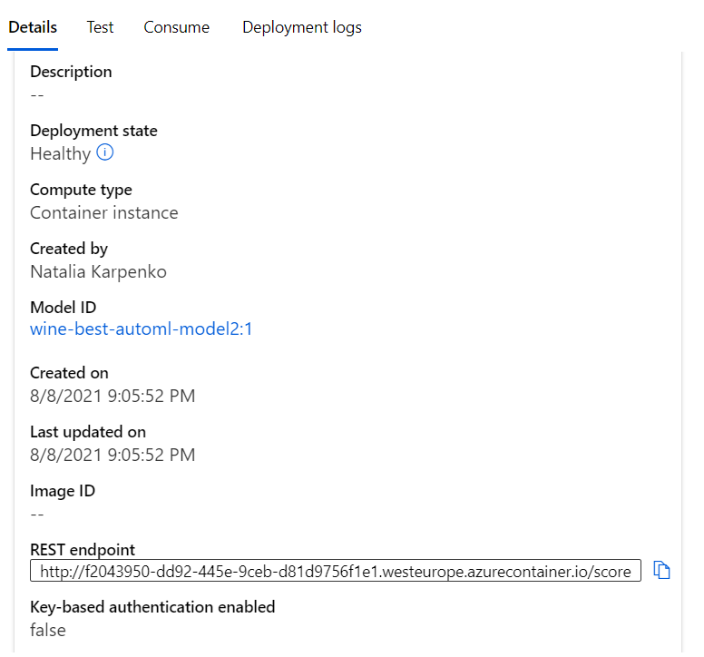
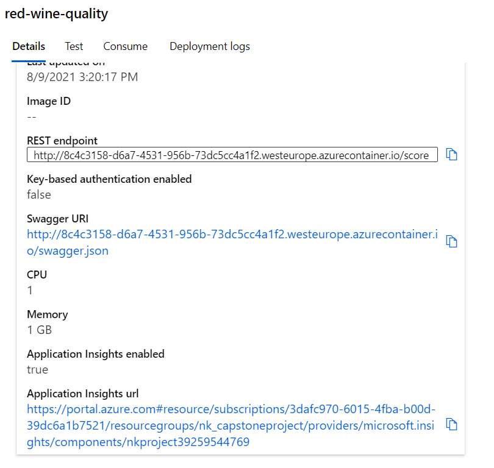
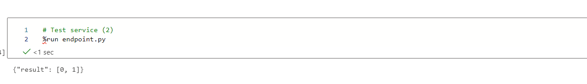

# Red wine quality predictions

The quality of wine depends on many many factors. Many of them are immeasurable or unpredictable, for example: the personal experience, some special feature of the barrels, weather, customer trends ect. But there are some objective features that define wine quantity, such as acidity, density, pH ecc.
Living in the area famous for its wines (Lombardy), I decided  to apply the course knowledge on the red wine quality prediction by running two types of experiment: Hyperdrive and AutoML and deploying the best model.  

## Dataset

### Overview
I used the dataset “red-wine-quality”.
The  dataset is related to red variants of the Portuguese "Vinho Verde" wine.  Due to privacy and logistic issues, only physicochemical (inputs) and sensory (the output) variables are available (e.g. there is no data about grape types, wine brand, wine selling price, etc.).
Dataset contains 1599 records , 11 input variables and the output variable (based on sensory data): quality, that has score values between 0 and 10.
L decided to transform the output variable to dichtome variable, following this rule: if the quantity of wine >= 7 , wine is “good” (1) end vice versa quality is “bad” (0).
Note: this transformation makes data imbalanced, it can lead to a falsely perceived positive effect of a model's accuracy because the input data has bias towards one class.

### Task
The goal of the project is to predict red wine quality (“good” vs “bad”) based on input features.

The input features are :
1 - fixed acidity

2 - volatile acidity

3 - citric acid

4 - residual sugar

5 - chlorides

6 - free sulfur dioxide

7 - total sulfur dioxide

8 - density

9 - pH

10 - sulphates

11 - alcohol

### Access
Since we talk about a kaggle dataset, I downloaded it as a csv file and uploaded to the ML Azure environment. The csv file has then been uploaded to the Azure ML to the blob storage:

## Automated ML

For this experiment I used the following AutoML settings:

automl_config = AutoMLConfig(
    compute_target = 'natcluster001',
    experiment_timeout_minutes=30,
    task= 'classification',
    primary_metric='accuracy',
    training_data= ds_t,
    label_column_name= 'quality',
    n_cross_validations= 2)

I also used the exiting experiment 'red-wine-quality'.

### Results

I was able to trace the automl run thanks to command RunDetails(wine_automl_run).show()

Here are some  parameters of my best AutoML model retrieved using code :

best_run, fitted_model = wine_automl_run.get_output()
print(fitted_model)

Pipeline(memory=None,
         steps=[('datatransformer',
                 DataTransformer(enable_dnn=False,
				 enable_feature_sweeping=True,
				 feature_sweeping_config={},
				 feature_sweeping_timeout=86400,
				 featurization_config=None, 
				 force_text_dnn=False,
				 is_cross_validation=True,
				 is_onnx_compatible=False, 
				 observer=None,
				 task='classification',
				 working_dir='/mnt/batch/tasks/shared/LS_root/mount...
				 
('kneighborsclassifier', 
KNeighborsClassifier(algorithm='auto', 
leaf_size=30,
 metric='manhattan', 
 metric_params=None, 
 n_jobs=1,
 n_neighbors=5,
 p=2, 
 weights='distance'))],
 verbose=False))], 
 flatten_transform=None, 
 weights=[0.08333333333333333, 0.08333333333333333, 0.08333333333333333, 0.08333333333333333, 0.08333333333333333, 0.08333333333333333, 0.3333333333333333, 0.16666666666666666]))]
 
 And the following snap shows all the ensemble algorithms:
 
 
 

The best AutoML model is VotingEnsemble whith the following metrics:

Accuracy
0.91244
AUC macro
0.89878
AUC micro
0.96362
AUC weighted
0.89878

I think that the accuracy of the best model is pretty high, but it can be altered by bias between classes of output variable. It can be a good idea to analyse dataset more balanced.

## Hyperparameter Tuning

I chose to apply the SKLearn  LogisticRegression with two parameters:

- C: Determines regularization strength (uniform range between 0.1 and 10). Higher C value means less regularization. 
- Maximum number of iterations: The maximum number of training iterations per child run. I chose the values [50, 75, 100, 125] to ottimize the execution times.

These parameters are selected randomly, with the help of RandomParameterSampling. For the termination policy the BanditPolicy was used.

### Results

Starting our Hyper Drive, it's possible to see the details with RunDetails widget:

The best Hyperparametric run has the following parameters:

## Model Deployment
Comparing two models we can see that the accuracy of AutoML best model is higher than the same metric of hyperparametric model and so I deployed the best AutoML model.

I also enabled the application insights:

To query  endpoint, we need to create a JSON object based on our scoring script as well as the Swagger JSON which functions as a schema. I user endpoint.py file with the following commands:

data = {"data":
        [
          {
            "fixed acidity": 5, 
            "volatile acidity": 4, 
            "citric acid": 7,
            "residual sugar": 3,
            "chlorides": 2,
            "free sulfur dioxide": 6,
            "total sulfur dioxide": 8, 
            "density": 4, 
            "pH": 7, 
            "sulphates": 6, 
            "alcohol": 10
          },
          {
            "fixed acidity": 7.3, 
            "volatile acidity": 0.65, 
            "citric acid": 0.0,
            "residual sugar": 1.2,
            "chlorides": 0.065,
            "free sulfur dioxide": 15.0,
            "total sulfur dioxide": 21.0, 
            "density": 0.9946, 
            "pH": 3.39, 
            "sulphates": 0.47, 
            "alcohol": 10.0
          },
      ]
    }

input_data = json.dumps(data)
resp = requests.post(uri, input_data, headers=headers)

The response:

## Future improvements

The analized data is unbalanced. As a future improvement of the model I can try the different type of refactoring of the output variable.
## Screen Recording
https://drive.google.com/file/d/1cqRVELSvoIJWdhq7okYWclMduKxqNZlB/view?usp=sharing

