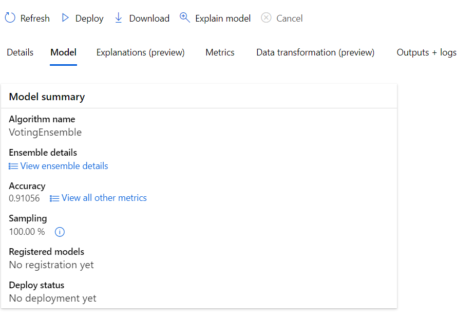

# Red wine quality predictions

The quality of wine depends on many many factors. Many of them are immeasurable or unpredictable, for example: the personal experience, some special feature of the barrels, weather, customer trends ect. But there are some objective features that define wine quantity, such as acidity, density, pH ecc.
Living in the area famous for its wines (Lombardy), I decided  to apply the course knowledge on the red wine quality prediction by running two types of experiment: Hyperdrive and AutoML and deploying the best model.  

## Dataset

### Overview
I used the dataset “red-wine-quality”.
The  dataset is related to red variants of the Portuguese "Vinho Verde" wine.  Due to privacy and logistic issues, only physicochemical (inputs) and sensory (the output) variables are available (e.g. there is no data about grape types, wine brand, wine selling price, etc.).
Dataset contains 1599 records , 11 input variables and the output variable (based on sensory data): quality, that has score values between 0 and 10.
L decided to transform the output variable to dichtome variable, following this rule: if the quantity of wine >= 7 , wine is “good” (1) end vice versa quality is “bad” (0).
Note: this transformation makes data imbalanced, it can lead to a falsely perceived positive effect of a model's accuracy because the input data has bias towards one class.

### Task
The goal of the project is to predict red wine quality (“good” vs “bad”) based on input features.

The input features are :
1 - fixed acidity

2 - volatile acidity

3 - citric acid

4 - residual sugar

5 - chlorides

6 - free sulfur dioxide

7 - total sulfur dioxide

8 - density

9 - pH

10 - sulphates

11 - alcohol

### Access
Since we talk about a kaggle dataset, I downloaded it as a csv file and uploaded to the ML Azure environment. The csv file has then been uploaded to the Azure ML to the blob storage:

## Automated ML

For this experiment I used the following AutoML settings:

automl_config = AutoMLConfig(
    compute_target = 'natcluster001',
    experiment_timeout_minutes=30,
    task= 'classification',
    primary_metric='accuracy',
    training_data= ds_t,
    label_column_name= 'quality',
    n_cross_validations= 2)

I also used the exiting experiment 'red-wine-quality'.

### Results

I was able to trace the automl run thanks to command RunDetails(wine_automl_run).show()

The best AutoML model is VotingEnsemble whith the following parameters:

Accuracy
0.91244
AUC macro
0.89878
AUC micro
0.96362
AUC weighted
0.89878

I think that the accuracy of the best model is pretty high, but it can be altered by bias between classes of output variable. It can be a good idea to analyse dataset more balanced.

## Hyperparameter Tuning
*TODO*: What kind of model did you choose for this experiment and why? Give an overview of the types of parameters and their ranges used for the hyperparameter search
I chose to apply the SKLearn  LogisticRegression with two parameters:

- C: Determines regularization strength (uniform range between 0.1 and 10). Higher C value means less regularization. 
- Maximum number of iterations: The maximum number of training iterations per child run. I chose the values [50, 75, 100, 125] to ottimize the execution times.

These parameters are selected randomly, with the help of RandomParameterSampling. For the termination policy the BanditPolicy was used.

### Results
*TODO*: What are the results you got with your model? What were the parameters of the model? How could you have improved it?

*TODO* Remeber to provide screenshots of the `RunDetails` widget as well as a screenshot of the best model trained with it's parameters.

## Model Deployment
*TODO*: Give an overview of the deployed model and instructions on how to query the endpoint with a sample input.

## Screen Recording
https://drive.google.com/file/d/1cqRVELSvoIJWdhq7okYWclMduKxqNZlB/view?usp=sharing

